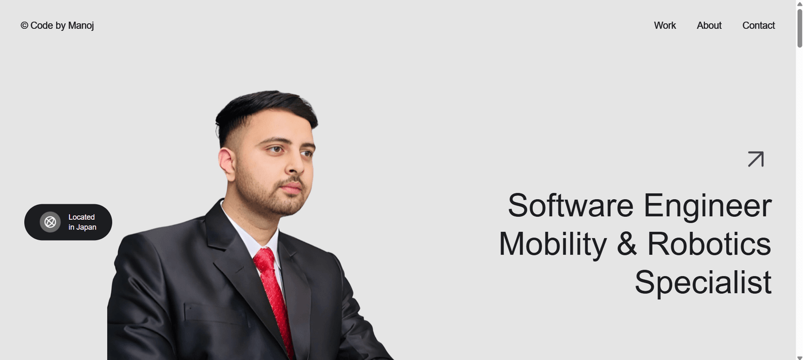

# Modern Interactive Portfolio

A premium, high-performance personal portfolio website built with a focus on smooth interactions, dynamic animations, and responsive design.

 *(Add a screenshot here)*

## ✨ Key Features

*   **Immersive Animations**: Powered by **GSAP (GreenSock)** and **AOS** for professional-grade entrance and scroll animations.
*   **Smooth Scrolling**: Integrated **Lenis** for a luxurious, buttery-smooth scroll experience.
*   **Parallax Effects**: Dynamic parallax scrolling on hero and about section images.
*   **Interactive UI**:
    *   **Magnetic Buttons**: Buttons that gravitationally pull towards the cursor.
    *   **Bento Grid Layout**: Modern, grid-based showcase for projects.
    *   **Project Modals**: Full-screen image previews with optimized constraints.
    *   **Timeline Modals**: Responsive academic history that adapts from accordions (desktop) to fullscreen modals (mobile).
*   **Dynamic Utility**:
    *   **Real-time Clock**: Automatically detects and displays the visitor's local time and timezone.
    *   **Preloader**: Multi-language greeting animation.
*   **Fully Responsive**: Meticulously crafted to look stunning on desktops, tablets, and mobile devices.
*   **PWA Support**: Installable as a home screen app on iOS/Android with a custom manifest and icon.
*   **Custom Iconography**: Features a custom-designed, photo-based premium icon for a polished mobile presence.

## 🛠️ Technologies Used

*   **HTML5**: Semantic structure.
*   **CSS3**: Custom styling, Flexbox/Grid layouts, and responsive media queries.
*   **JavaScript (ES6+)**: Logic for interactions, dynamic content, and isolated script modules for stability.

### Libraries & Dependencies
*   [GSAP](https://greensock.com/gsap/) (Core + ScrollTrigger) - Advanced animations.
*   [Lenis](https://github.com/studio-freight/lenis) - Smooth scrolling.
*   [AOS](https://michalsnik.github.io/aos/) - Animate On Scroll library.

## 🚀 Getting Started

Since this is a static site project, no build process or server installation is required.

1.  **Clone or Download** the repository.
2.  **Open** `index.html` directly in your web browser.
3.  That's it!

## 📁 Project Structure

```text
/
├── index.html      # Main entry point containing HTML, CSS, and JS
├── about.jpeg          # Profile image
├── model.png           # Hero image
├── SNS_Website.png     # Project screenshot
├── budget.png          # Project screenshot (Budget Tracker)
└── ...                 # Other asset files
```

## 🎨 Customization

*   **Content**: Edit the HTML text content directly in `index.html`.
*   **Images**: Replace the image files in the root folder with your own assets (maintain filenames or update `src` attributes).
*   **Colors**: CSS variables and styles are defined in the `<style>` block within the head.

## 📄 License

This project is open-source and available for personal use and modification.

---
*Created by Manoj Poudel*

