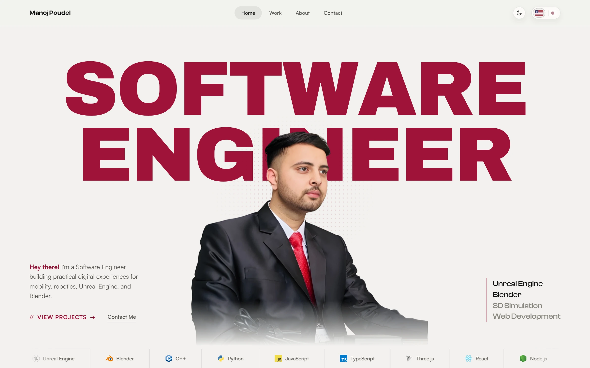

<h1 align="center">Manoj Poudel · Portfolio</h1>

<p align="center">
  Software Engineering · Real-time 3D · Web Development<br>
  Based in Tokyo, Japan · Available in English and Japanese
</p>

<p align="center">
  <a href="https://pro-portfolio-mocha.vercel.app/"><strong>View live portfolio ↗</strong></a>
  &nbsp; · &nbsp;
  <a href="#selected-work">Explore the projects</a>
  &nbsp; · &nbsp;
  <a href="https://www.linkedin.com/in/manojpoudel0429/">Connect on LinkedIn</a>
</p>

[](https://pro-portfolio-mocha.vercel.app/)

<p align="center"><sub>Desktop landing page · Light theme · Captured from the live website</sub></p>

## Overview

This is the source for my personal portfolio: a collection of web applications,
3D asset tools, and Unreal Engine projects, alongside my professional experience,
education, and certifications.

The site brings those different disciplines into one consistent experience.
Large editorial typography introduces the work; project previews, concise
descriptions, and links provide a closer look at what each project does.

Built with **HTML, CSS, and vanilla JavaScript**, the portfolio runs as a static
site. There is no application framework, dependency installation, or build step
required to serve it. The applications and tools it showcases are separate projects.

## Selected work

| Project | Focus | Explore |
| --- | --- | --- |
| **Everest Travel Experience** | A bilingual travel website for Himalayan expeditions and curated adventures. | [Live website](https://travel-site-delta-five.vercel.app/) |
| **Personal Finance App** | Budgeting, transaction tracking, receipt scanning, and spending insights. | [Live app](https://budget-tracker-v2-gamma.vercel.app/) |
| **Salary Tracker App** | Salary records, earnings, and remittance tracking. | [Live app](https://salary-tracker-v3-six.vercel.app/) |
| **GLB Insight — Analyzer** | Inspection of 3D model geometry, textures, file size, and exportable reports. | [Source code](https://github.com/manojpoudel9256/GLBAnalyzer) |
| **GLB Forge — Optimizer** | Mesh simplification, texture optimization, and before/after inspection for real-time 3D workflows. | [Source code](https://github.com/manojpoudel9256/GLBOptimizer) |
| **Darts Game** | A third-person Unreal Engine game exploring aiming, scoring, and player interaction. | [Full video](https://www.linkedin.com/posts/manojpoudel0429_unrealengine-ue5-gamedev-activity-7488763663969865729-xFQf) |
| **Warehouse Simulation** | An Unreal Engine simulation featuring conveyors, storage racks, and robotic equipment. | [Full video](https://www.linkedin.com/posts/manojpoudel0429_unrealengine-ue5-digitaltwin-activity-7505517491381489664-4iHa) |

## Experience and design

- **English and Japanese:** translated interface and project descriptions, with a saved language preference.
- **Light and dark themes:** coordinated surfaces, typography, and accents, with a saved theme preference.
- **Dedicated phone layouts:** readable stacked cards, larger touch targets, a compact navigation drawer, and inputs sized for mobile browsing.
- **On-demand video:** short 1080p Unreal Engine previews load after interaction. Touch phones use optimized MP4; desktop retains WebM-first playback with an MP4 fallback.
- **Project and photo viewers:** inspect project details or the original education photographs without scrolling the page behind the overlay.
- **Considered motion:** a code-rendered `hello` introduction, scroll reveals, and reduced-motion handling. The introduction can be skipped.
- **Direct contact:** email, social profiles, and a contact form delivered through Formspree.

The visual system combines a burgundy hero with warm ivory and copper content
sections. Archivo Black and Playfair Display establish the hierarchy, supported
by Satoshi body text and IBM Plex Mono labels. Phone refinements are isolated
from the desktop composition.

## Implementation

| Layer | Implementation |
| --- | --- |
| Structure and content | Semantic HTML, project data, and EN/JA dictionaries in `index.html` |
| Presentation | CSS custom properties, Grid, Flexbox, and focused stylesheets for shared and mobile layouts |
| Interaction | Vanilla JavaScript for navigation, themes, translation, filters, dialogs, and playback |
| Animation | GSAP, ScrollTrigger, and Lenis; standalone CSS/JavaScript for the preloader |
| Media | WebP project covers, self-hosted WOFF2 fonts, and on-demand WebM/MP4 previews |
| Contact delivery | Formspree |
| Hosting | Vercel static deployment |
| Verification | Node's built-in test runner and optional Playwright browser checks |

GSAP, ScrollTrigger, Lenis, and the Google-hosted display fonts require a network
connection. Other fonts and portfolio media are served from this repository.
The contact form requires Formspree connectivity.

## Run locally

With Git and Python 3 installed:

```bash
git clone https://github.com/manojpoudel9256/pro-portfolio.git
cd pro-portfolio
python -m http.server 4173 --bind 127.0.0.1
```

Open **[localhost:4173](http://localhost:4173/)**. A local HTTP server is recommended
for consistent media loading and browser behavior.

For layout work, skip the opening animation with `?nopreload=1`. Add
`&theme=light` or `&theme=dark` to inspect a specific theme:

```text
http://localhost:4173/?nopreload=1&theme=light
```

## Repository guide

```text
.
├── index.html                 # Page content, base styles, project data, translations
├── refinements.css            # Shared visual system
├── mobile-refinements.css      # Phone layouts, scoped to 768px and below
├── mobile-menu.css / .js       # Mobile navigation and focus/scroll handling
├── preloader.css / .js         # Opening typography animation
├── unreal-projects.css / .js   # Unreal Engine cards and media lifecycle
├── manifest.json              # App metadata and home-screen icons
├── fonts/                     # Self-hosted typefaces and mobile font instances
├── assets/
│   ├── icons/                 # Favicons and app icons
│   ├── logos/                 # Branding, technology, and certification marks
│   ├── images/                # Portraits, projects, education, and documentation
│   └── videos/unreal-engine/  # Optimized project previews
└── tests/                     # Interaction tests and optional browser checks
```

To update project content, edit the `PROJECTS` object and the corresponding
English/Japanese entries in `index.html`. Keep phone styling in
`mobile-refinements.css`; its stylesheet link and rules both use a 768px media
guard. Update the Formspree action and personal links if adapting the site.

Further documentation:

- [Asset organization and naming](assets/README.md)
- [Design decisions and project artwork](DESIGN-REFINEMENT.md)
- [Mobile refinements and browser verification](MOBILE-REFINEMENT.md)
- [Video encoding and delivery](assets/videos/unreal-engine/README.md)
- [Unreal Engine cover artwork](assets/images/projects/unreal-engine/ARTWORK.md)
- [Mobile font instances](fonts/MOBILE-FONTS.md)

## Verification

Run the interaction tests with Node.js:

```bash
node --test --test-isolation=none tests/mobile-menu.test.cjs tests/unreal-projects.test.cjs
```

These cover navigation focus, scroll locking, keyboard behavior, deferred media
loading, format selection, playback errors, and language updates.

Optional Playwright checks capture each section and inspect overflow, touch
targets, dialogs, and video playback. The mobile review includes the iPhone 14
Pro Max portrait viewport, smaller phone widths, English/Japanese, and both
themes. Desktop regression checks compare screenshots and element layout at
1024, 1440, and 1920px. See the [verification instructions](MOBILE-REFINEMENT.md#run-the-optional-browser-checks).
Browser emulation complements physical-device testing; it does not replace it.

## Deployment

The repository can be served by a static host. For Vercel:

| Setting | Value |
| --- | --- |
| Framework preset | Other |
| Root directory | Repository root |
| Build command | None |
| Output directory | Repository root (`.`) |

Publish the HTML, stylesheets, scripts, fonts, manifest, and asset directories
together. No server process or environment variables are required by the
portfolio itself.

**Live:** [pro-portfolio-mocha.vercel.app](https://pro-portfolio-mocha.vercel.app/)

## Connect

I'm interested in practical software, real-time 3D, and opportunities to build
useful products with thoughtful teams.

[LinkedIn](https://www.linkedin.com/in/manojpoudel0429/) ·
[GitHub](https://github.com/manojpoudel9256) ·
[Email](mailto:poudelmanoj604@gmail.com)

---

<sub>Designed and developed by Manoj Poudel · Tokyo, Japan</sub>
